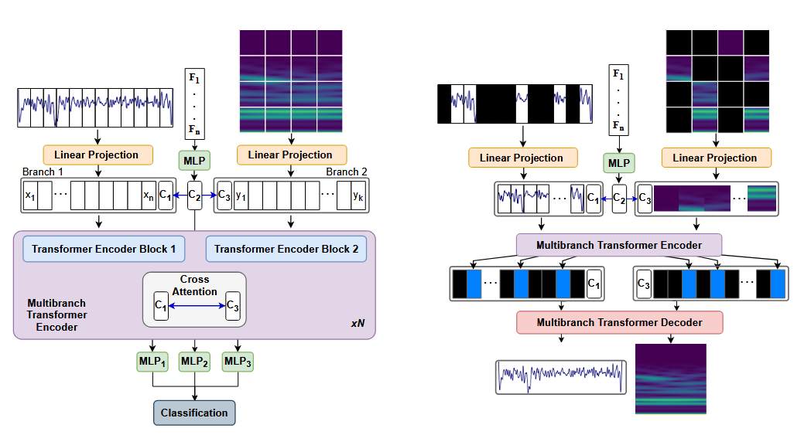

# 🧬 Multi-Modal Transformer for Peptide Classification

This repository contains a **multi-modal transformer architecture** designed to process **time series**, **image**, and **feature vector** data simultaneously.  
It can be trained in a **masked autoencoder (MAE)** style to reconstruct inputs and later fine-tuned on a **classification task**.

The model was developed to **classify peptides and proteins from nanopore measurements**.  
To that end, time series signals are:
- Transformed into **Wavelet images**
- Enriched with **catch22 features**
- Combined with the **original time series** data

This approach leads to a **significant improvement in peptide classification** accuracy.  
The architecture is flexible and can be adapted for other **multi-modal classification tasks** with arbitrary combinations of time series, images, and feature vectors.

---

> ⚠️ **Patent Notice**  
> The described method is protected under **German Patent No. 10 2025 123 407.8**.  
> A related **scientific publication** is currently in preparation.  
> Use of this patented approach for commercial or derivative work may require a **license agreement**.

---

## 📚 Previous Work

This model builds on prior research conducted at the [Institute for Computational Physics](https://www.icp.uni-stuttgart.de/) at the University of Stuttgart, which laid the foundation for the multi-modal transformer approach:

1. **Hoßbach et al., 2025** - *Peptide classification from statistical analysis of nanopore sensing experiments*
   DOI: [10.1063/5.0250399](https://doi.org/10.1063/5.0250399)
2. **Tovey et al., 2025** - *Deep Learning-Driven Peptide Classification in Biological Nanopores*
   DOI: [10.48550/arXiv.2509.14029](https://doi.org/10.48550/arXiv.2509.14029)
   
---

## ✨ Features

- 🔗 **Multi-Modal Transformer** capable of processing any number of **time series**, **image**, and **feature vector** inputs  
- 🧠 **Pre-training as a Masked Autoencoder (MAE)**  
- 🎯 **Fine-tuning for classification**  
- ⚖️ **Flexible configuration** — train and compare different model subsets:
  - Multi-modal model combining **time series** and **images**
  - Multi-modal model combining **time series** and a **feature vector**
  - **Vision Transformer (ViT)** implementation (MAE pre-training + classification)
  - **Time Series Transformer** implementation (MAE pre-training + classification)
- 🔍 **Attention weight extraction** for interpretability and attention map analysis

## ⚙️ Installation

### Requirements

### Setup

## 🚀 Usage

## 🤖 Multi-modal Transformer architecture

  

- **Classification (left):**
  - Time series and image are split into fragments → linear layer → input tokens.
  - Learnable positional embeddings added; classification tokens (CLS) C1 and C3 appended.
  - C2 is created from the feature vector input
  - Cross-attention transfers info from C2 to C1 and C3 once.
  - Multi-branch transformer encoder processes time and image information (alternating between cross attention and single-branch      attention).

- **Pre-training (right):**
  - Parts of time series and image are masked; only unmasked tokens go through the encoder.
  - Descriptor info (C2) is transferred once to C1 and C3.
  - Encoder processes unmasked tokens
  - Decoder reconstructs original time series and image.
    
**Highly flexible:** the dimensions of each branch, the number of single-branch attentions, and the number of cross-attention steps can be chosen individually.

> **Note:** This architecture is inspired by [CrossViT](https://arxiv.org/abs/2103.14899), adapted for multi-modal inputs including time series, images, and feature vectors.

##  Open Problems and Possible Improvements

- **Descriptor Feed-Forward:** Currently hardcoded; should be refactored into a flexible module or configurable entry.  
- **Model Modularity:** Each model variant (e.g., multi-modal, image-only, time-series-only) should be implemented as a separate `nn.Module` to allow seamless integration into any `LightningModule`.  
- **Missing Implementations:** Some models are not yet included:  
  - Time Series Transformer  
  - Vision Transformer (ViT)  
  - Multi-modal model combining **time series** and **images**  
  - Multi-modal model combining **time series** and a **feature vector**  

